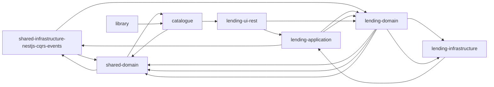

# nx-mermaid-grapher

A utility to create [`MermaidJS`](https://mermaid.js.org/) graphs for [NX dependency graphs](https://nx.dev/packages/nx/documents/dep-graph).


## Example

We can use [this example project](https://github.com/ddd-by-examples/library-nestjs) to try it out.

If you clone the project, and run [`nx dep-graph` (or `nx graph`)](https://nx.dev/packages/nx/documents/dep-graph) we'd get something similar to:


And below is the generated `mermaid.js` graph ([you can use controllers!](https://github.blog/2022-02-14-include-diagrams-markdown-files-mermaid/)):



Markdown:

```md
    ```mermaid
    graph LR
        shared-infrastructure-nestjs-cqrs-events-->shared-domain
        lending-infrastructure-->lending-application-->shared-infrastructure-nestjs-cqrs-events-->lending-domain-->shared-domain
        lending-application-->lending-domain-->shared-domain-->catalogue
        lending-ui-rest-->lending-application-->lending-domain-->lending-infrastructure
        lending-domain-->shared-domain
        catalogue-->shared-domain-->shared-infrastructure-nestjs-cqrs-events
        library-->catalogue-->lending-ui-rest-->lending-domain-->lending-infrastructure
    ```
```

## Usage

### CLI

*tbd*

### Code

*tbd*

## Contributing

Pull requests are welcome. For major changes, please open an issue first to discuss what you would like to change.

Please make sure to update tests as appropriate.

## License

This project is licensed under the MIT License - see the [LICENSE](./LICENSE) file for details