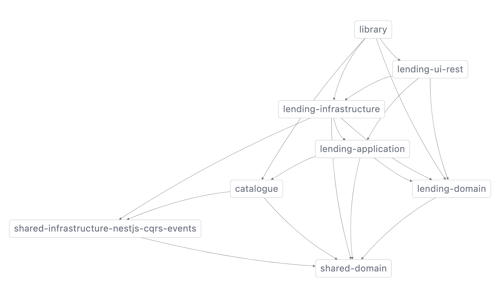
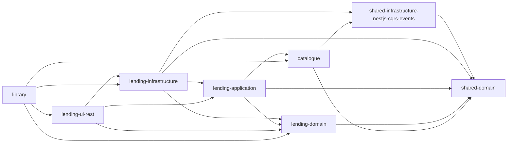

# nx-mermaid-grapher

[](https://dashboard.stryker-mutator.io/reports/github.com/Fcmam5/nx-mermaid-grapher/develop) [](https://snyk.io/test/github/Fcmam5/nx-mermaid-grapher) [](https://codecov.io/gh/Fcmam5/nx-mermaid-grapher) [](https://www.npmjs.com/package/nx-mermaid-grapher)

A utility to create [`MermaidJS`](https://mermaid.js.org/) graphs for [NX dependency graphs](https://nx.dev/packages/nx/documents/dep-graph).


## Example

We can use [this example project](https://github.com/ddd-by-examples/library-nestjs) to try it out.

If you clone the project, and run [`nx dep-graph` (or `nx graph`)](https://nx.dev/packages/nx/documents/dep-graph) we'd get something similar to:



And below is the generated `mermaid.js` graph ([you can use controllers!](https://github.blog/2022-02-14-include-diagrams-markdown-files-mermaid/)):



Markdown:

<pre>

</pre>

## Usage

### CLI

To run this tool from your CLI, you need to install it globally with:

```bash
npm i -g nx-mermaid-grapher


# or using npx
npx nx-mermaid-grapher -f file.json
```

Then, run it with `-f [PATH]` or `--file [PATH]` parameter providing the path for your NX graph JSON output file.

```
Options:
      --help     Show help                                             [boolean]
      --version  Show version number                                   [boolean]
  -f, --file     NX graph output file (see:
                 https://nx.dev/packages/nx/documents/dep-graph#file)
                                                             [string] [required]
  -e, --exclude  Exclude a library                                       [array]
```

**Example**:

```bash
npx nx-mermaid-grapher -f tests/mocks/ddd-example.graph.json
```

Optionally you can exclude one, or multiple libraries. For example:

```bash
npx nx-mermaid-grapher -f tests/mocks/ddd-example.graph.json -e lending-infrastructure -e lending-ui-rest
```

### Code

If you want to extend this library, you may want to instantiate the exposed classes and use them, for example:

```ts
import { DiGraph, NXGraphFileLoader, NxMermaidGrapher } from 'nx-mermaid-grapher';

const loader = new NXGraphFileLoader();
const diGraph = new DiGraph();
const core = new NxMermaidGrapher(loader, diGraph);

core.init('path/to/file');

const logMerMaidInMd = (str: string) => `\`\`\`mermaid\n${str}\`\`\``;

console.log(logMerMaidInMd(core.getGraphSnippet()));
```

Or, if you wish to use a different graph than the default [DiGraph](./lib/data-structures/di-graph.ds.ts) (Directed graph), you may implement the `IGraph<T>` class and implement your own methods, for example:

```ts
import { IGraph } from "nx-mermaid-grapher/dist/data-structures/graph.ds.interface";

class SomeGraph implements IGraph<MyType> {
    addNode(nodeVal: MyType): void {
        throw new Error("Method not implemented.");
    }
    addEdge(source: MyType, destination: MyType): void {
        throw new Error("Method not implemented.");
    }
    getGraph(): { [key: string]: MyType[]; } {
        throw new Error("Method not implemented.");
    }
}
```

Then just pass it to `NxMermaidGrapher` constructor.

```ts
import {  NXGraphFileLoader, NxMermaidGrapher } from 'nx-mermaid-grapher';

const loader = new NXGraphFileLoader();
const myGraph = new SomeGraph();
const core = new NxMermaidGrapher(loader, myGraph);
```

## Contributing

Pull requests are welcome. For major changes, please open an issue first to discuss what you would like to change.

Please make sure to update tests as appropriate.

## License

This project is licensed under the MIT License - see the [LICENSE](./LICENSE) file for details