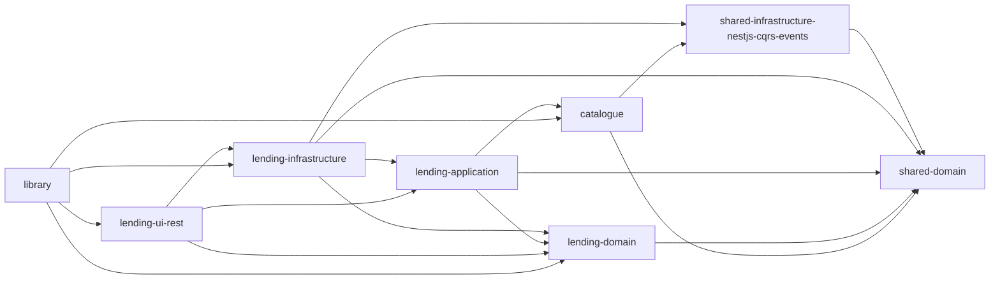

# nx-mermaid-grapher

[](https://dashboard.stryker-mutator.io/reports/github.com/Fcmam5/nx-mermaid-grapher/develop) [](https://snyk.io/test/github/Fcmam5/nx-mermaid-grapher) [](https://codecov.io/gh/Fcmam5/nx-mermaid-grapher) [](https://www.npmjs.com/package/nx-mermaid-grapher)

A utility to create [`MermaidJS`](https://mermaid.js.org/) graphs for [NX dependency graphs](https://nx.dev/packages/nx/documents/dep-graph).

<!-- omit in toc -->
## Table of Contents
- [nx-mermaid-grapher](#nx-mermaid-grapher)
  - [Example](#example)
  - [Usage](#usage)
    - [CLI](#cli)
    - [Code](#code)
  - [Recipes](#recipes)
    - [Render only the libs affected by a PR](#render-only-the-libs-affected-by-a-pr)
    - [Auto-post the affected graph as a PR comment (GitHub Actions)](#auto-post-the-affected-graph-as-a-pr-comment-github-actions)
  - [Project documents](#project-documents)
  - [Contributing](#contributing)
  - [License](#license)

## Example

We can use [this example project](https://github.com/ddd-by-examples/library-nestjs) to try it out.

If you clone the project, and run [`nx dep-graph` (or `nx graph`)](https://nx.dev/packages/nx/documents/dep-graph) we'd get something similar to:


And below is the generated `mermaid.js` graph ([you can use controllers!](https://github.blog/2022-02-14-include-diagrams-markdown-files-mermaid/)):


```mermaid
    graph LR
      shared-infrastructure-nestjs-cqrs-events --> shared-domain
      lending-infrastructure --> lending-application
      lending-infrastructure --> shared-infrastructure-nestjs-cqrs-events
      lending-infrastructure --> lending-domain
      lending-infrastructure --> shared-domain
      lending-application --> lending-domain
      lending-application --> shared-domain
      lending-application --> catalogue
      lending-ui-rest --> lending-application
      lending-ui-rest --> lending-domain
      lending-ui-rest --> lending-infrastructure
      lending-domain --> shared-domain
      catalogue --> shared-domain
      catalogue --> shared-infrastructure-nestjs-cqrs-events
      library --> catalogue
      library --> lending-ui-rest
      library --> lending-domain
      library --> lending-infrastructure
```

Markdown:

<pre>

```mermaid
    graph LR
        shared-infrastructure-nestjs-cqrs-events --> shared-domain
        lending-infrastructure --> lending-application
        lending-infrastructure --> shared-infrastructure-nestjs-cqrs-events
        lending-infrastructure --> lending-domain
        lending-infrastructure --> shared-domain
        lending-application --> lending-domain
        lending-application --> shared-domain
        lending-application --> catalogue
        lending-ui-rest --> lending-application
        lending-ui-rest --> lending-domain
        lending-ui-rest --> lending-infrastructure
        lending-domain --> shared-domain
        catalogue --> shared-domain
        catalogue --> shared-infrastructure-nestjs-cqrs-events
        library --> catalogue
        library --> lending-ui-rest
        library --> lending-domain
        library --> lending-infrastructure
```
</pre>

## Usage

### CLI

To run this tool from your CLI, you need to install it globally with:

```bash
npm i -g nx-mermaid-grapher


# or using npx
npx nx-mermaid-grapher -f file.json
```

Then, run it with `-f [PATH]` or `--file [PATH]` parameter providing the path for your NX graph JSON output file.

```
Usage: nx-mermaid-grapher -f <path> [-e <lib>]...

Options:
  -f, --file <path>     NX graph output file
                        (see: https://nx.dev/packages/nx/documents/dep-graph#file)
  -e, --exclude <lib>   Exclude a library (repeatable)
  -h, --help            Show help
  -V, --version         Show version
```

**Example**:

```bash
npx nx-mermaid-grapher -f tests/mocks/ddd-example.graph.json
```

Optionally you can exclude one, or multiple libraries. For example:

```bash
npx nx-mermaid-grapher -f tests/mocks/ddd-example.graph.json -e lending-infrastructure -e lending-ui-rest
```

### Code

If you want to extend this library, you may want to instantiate the exposed classes and use them, for example:

```ts
import { DiGraph, NXGraphFileLoader, NxMermaidGrapher } from 'nx-mermaid-grapher';

const loader = new NXGraphFileLoader();
const diGraph = new DiGraph();
const core = new NxMermaidGrapher(loader, diGraph);

core.init('path/to/file');

const logMerMaidInMd = (str: string) => `\`\`\`mermaid\n${str}\`\`\``;

console.log(logMerMaidInMd(core.getGraphSnippet()));
```

Or, if you wish to use a different graph than the default [DiGraph](./lib/data-structures/di-graph.ds.ts) (Directed graph), you may implement the `IGraph<T>` class and implement your own methods, for example:

```ts
import { IGraph } from "nx-mermaid-grapher/dist/data-structures/graph.ds.interface";

class SomeGraph implements IGraph<MyType> {
    addNode(nodeVal: MyType): void {
        throw new Error("Method not implemented.");
    }
    addEdge(source: MyType, destination: MyType): void {
        throw new Error("Method not implemented.");
    }
    getGraph(): { [key: string]: MyType[]; } {
        throw new Error("Method not implemented.");
    }
}
```

Then just pass it to `NxMermaidGrapher` constructor.

```ts
import {  NXGraphFileLoader, NxMermaidGrapher } from 'nx-mermaid-grapher';

const loader = new NXGraphFileLoader();
const myGraph = new SomeGraph();
const core = new NxMermaidGrapher(loader, myGraph);
```

## Recipes

### Render only the libs affected by a PR

`nx graph` can produce an _affected-only_ subset of the workspace graph as JSON,
which `nx-mermaid-grapher` consumes as-is. Two commands are all you need:

```bash
# 1. Generate JSON for the projects affected against your target branch.
npx nx graph --affected --file=affected.json --base=origin/develop

# 2. Convert it into a Mermaid block ready to paste into a PR description.
npx nx-mermaid-grapher -f affected.json
```

You can swap `--base=origin/develop` for `origin/main` (or any commit-ish) and
combine with `-e <lib>` to hide noisy projects from the rendered graph.

### Auto-post the affected graph as a PR comment (GitHub Actions)

Drop the workflow below at `.github/workflows/affected-graph.yaml` to have a
fresh dependency-impact diagram appear on every pull request:

```yaml
name: Affected dep graph

on:
  pull_request:
    branches: [develop, main]

permissions:
  contents: read
  pull-requests: write

jobs:
  graph:
    runs-on: ubuntu-latest
    steps:
      - uses: actions/checkout@v4
        with:
          # Required so `--base=origin/${{ github.base_ref }}` has history.
          fetch-depth: 0

      - uses: actions/setup-node@v4
        with:
          node-version: 22
          cache: npm

      - run: npm ci

      - name: Generate affected Mermaid graph
        run: |
          npx nx graph --affected --file=affected.json --base=origin/${{ github.base_ref }}
          {
            echo '## Affected dependency graph'
            echo
            npx nx-mermaid-grapher -f affected.json
          } > graph.md

      - name: Comment on the PR
        env:
          GH_TOKEN: ${{ secrets.GITHUB_TOKEN }}
        run: gh pr comment "${{ github.event.pull_request.number }}" --body-file graph.md
```

This posts a new comment on each push. If you would rather _update_ a single
sticky comment in place, swap the last step for an action like
[`peter-evans/create-or-update-comment`](https://github.com/peter-evans/create-or-update-comment).

## Project documents

- [Changelog](./CHANGELOG.md) — release history and notable changes.
- [Contributing](./CONTRIBUTING.md) — how to set up the project and propose changes.
- [Code of Conduct](./CODE_OF_CONDUCT.md) — community expectations.
- [Security policy](./SECURITY.md) — how to report vulnerabilities.
- [Privacy policy](./PRIVACY.md) — what data the tool does (and does not) handle.

## Contributing

Pull requests are welcome. For major changes, please open an issue first to discuss what you would like to change.

Please make sure to update tests as appropriate. See [`CONTRIBUTING.md`](./CONTRIBUTING.md) for development setup and the [Code of Conduct](./CODE_OF_CONDUCT.md).

## License

This project is licensed under the MIT License - see the [LICENSE](./LICENSE) file for details