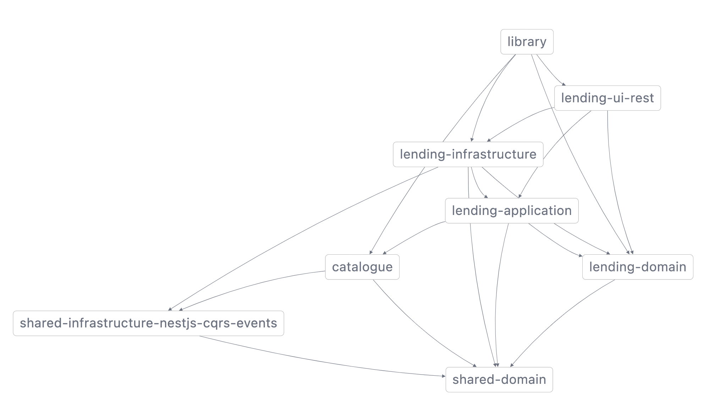
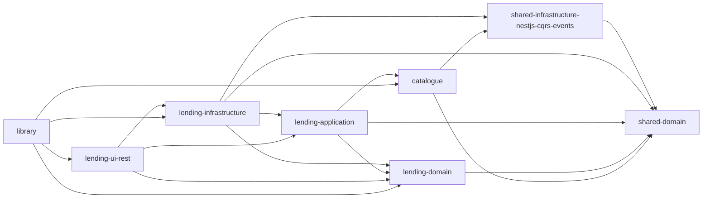

# nx-mermaid-grapher

[](https://dashboard.stryker-mutator.io/reports/github.com/Fcmam5/nx-mermaid-grapher/develop) [](https://snyk.io/test/github/Fcmam5/nx-mermaid-grapher) [](https://codecov.io/gh/Fcmam5/nx-mermaid-grapher) [](https://www.npmjs.com/package/nx-mermaid-grapher)

A utility to create [`MermaidJS`](https://mermaid.js.org/) graphs for [NX dependency graphs](https://nx.dev/packages/nx/documents/dep-graph).

> [!TIP]
> **Using this from an AI coding agent?** `nx-mermaid-grapher` is designed to be
> a token-cheap window into an Nx workspace. Instead of feeding the model the
> full `nx graph` JSON (often tens to hundreds of kB), have the agent shell out
> to this CLI with `--format edges` or `--format json` to get a compact view of
> the dependency topology. The default `mermaid` output is great for **showing
> the result back to the user** — it renders natively in GitHub/GitLab markdown
> and in VS Code-based editors (Cursor, Windsurf, VSCodium, ...) with a Mermaid
> preview extension. See [Output formats](#output-formats) below for the short
> version, or the [Usage guide](./docs/usage-guide.md) for a full walkthrough
> of every format with realistic examples.

<!-- omit in toc -->
## Table of Contents
- [nx-mermaid-grapher](#nx-mermaid-grapher)
  - [Example](#example)
  - [Usage](#usage)
    - [CLI](#cli)
      - [Output formats](#output-formats)
    - [Code](#code)
  - [Recipes](#recipes)
    - [Render only the libs affected by a PR](#render-only-the-libs-affected-by-a-pr)
    - [Auto-post the affected graph as a PR comment (GitHub Actions)](#auto-post-the-affected-graph-as-a-pr-comment-github-actions)
  - [Project documents](#project-documents)
  - [Contributing](#contributing)
  - [License](#license)

## Example

We can use [this example project](https://github.com/ddd-by-examples/library-nestjs) to try it out.

If you clone the project, and run [`nx dep-graph` (or `nx graph`)](https://nx.dev/packages/nx/documents/dep-graph) we'd get something similar to:



And below is the generated `mermaid.js` graph ([you can use controllers!](https://github.blog/2022-02-14-include-diagrams-markdown-files-mermaid/)):


```mermaid
    graph LR
      shared-infrastructure-nestjs-cqrs-events --> shared-domain
      lending-infrastructure --> lending-application
      lending-infrastructure --> shared-infrastructure-nestjs-cqrs-events
      lending-infrastructure --> lending-domain
      lending-infrastructure --> shared-domain
      lending-application --> lending-domain
      lending-application --> shared-domain
      lending-application --> catalogue
      lending-ui-rest --> lending-application
      lending-ui-rest --> lending-domain
      lending-ui-rest --> lending-infrastructure
      lending-domain --> shared-domain
      catalogue --> shared-domain
      catalogue --> shared-infrastructure-nestjs-cqrs-events
      library --> catalogue
      library --> lending-ui-rest
      library --> lending-domain
      library --> lending-infrastructure
```

Markdown:

<pre>

```mermaid
    graph LR
        shared-infrastructure-nestjs-cqrs-events --> shared-domain
        lending-infrastructure --> lending-application
        lending-infrastructure --> shared-infrastructure-nestjs-cqrs-events
        lending-infrastructure --> lending-domain
        lending-infrastructure --> shared-domain
        lending-application --> lending-domain
        lending-application --> shared-domain
        lending-application --> catalogue
        lending-ui-rest --> lending-application
        lending-ui-rest --> lending-domain
        lending-ui-rest --> lending-infrastructure
        lending-domain --> shared-domain
        catalogue --> shared-domain
        catalogue --> shared-infrastructure-nestjs-cqrs-events
        library --> catalogue
        library --> lending-ui-rest
        library --> lending-domain
        library --> lending-infrastructure
```
</pre>

## Usage

### CLI

To run this tool from your CLI, you need to install it globally with:

```bash
npm i -g nx-mermaid-grapher


# or using npx
npx nx-mermaid-grapher -f file.json
```

Then, run it with `-f [PATH]` or `--file [PATH]` parameter providing the path for your NX graph JSON output file.

```
Usage: nx-mermaid-grapher -f <path> [-o <format>] [-e <lib>]... [--raw]

Options:
  -f, --file <path>      NX graph output file
                         (see: https://nx.dev/packages/nx/documents/dep-graph#file)
  -o, --format <format>  Output format: mermaid | edges | json | dot (default: mermaid)
  -e, --exclude <lib>    Exclude a library (repeatable)
      --raw              Emit raw Mermaid (no ```mermaid markdown fence)
  -h, --help             Show help
  -V, --version          Show version
```

**Example**:

```bash
npx nx-mermaid-grapher -f tests/mocks/ddd-example.graph.json
```

Optionally you can exclude one, or multiple libraries. For example:

```bash
npx nx-mermaid-grapher -f tests/mocks/ddd-example.graph.json -e lending-infrastructure -e lending-ui-rest
```

#### Output formats

Pass `-o <format>` (or `--format`) to switch the output. The default is
`mermaid`; the others exist so scripts and AI agents can consume the topology
cheaply without re-parsing the much larger raw Nx graph JSON. Concretely, on
the bundled DDD example fixture:

| Output                | Size      |
| --------------------- | --------- |
| raw `nx graph` JSON   | ~49,500 B |
| `-o mermaid` (default)| ~770 B    |
| `-o json`             | ~935 B    |
| `-o edges`            | ~640 B    |
| `-o stats`            | ~730 B    |

The exact ratio depends on the workspace, but the trend is the same: the raw
graph carries per-project metadata (`files`, `targets`, `tags`, …) that this
tool strips down to just the topology.

| Format    | Use case                                                                                        |
| --------- | ----------------------------------------------------------------------------------------------- |
| `mermaid` | Paste into a Markdown doc, PR description, GitHub/GitLab README, or a chat reply. Renders natively on GitHub/GitLab and in VS Code-based editors (Cursor, Windsurf, VSCodium, …) with a Mermaid preview extension. Wrapped in a `\`\`\`mermaid` fence by default. |
| `edges`   | One `source target` pair per line. Minimal whitespace, easy to `awk`/`grep`/feed to an LLM.     |
| `json`    | Compact `{ "nodes": [...], "edges": [[src, dst], ...] }`. Includes isolated nodes.              |
| `dot`     | Graphviz `digraph` declaration; pipe into `dot -Tsvg` to render an image.                       |
| `stats`   | Plain-text summary: counts, roots/leaves, cycle flag, max depth + example longest path, per-project fan-in/fan-out. Single token-cheap snapshot of workspace shape. |

Examples:

```bash
# Raw Mermaid body (no markdown fence) — handy when piping into a templater.
npx nx-mermaid-grapher -f graph.json --raw

# Plain edge list — the cheapest format for an AI agent to reason about.
npx nx-mermaid-grapher -f graph.json -o edges

# Compact JSON.
npx nx-mermaid-grapher -f graph.json -o json

# Graphviz, rendered to SVG.
npx nx-mermaid-grapher -f graph.json -o dot | dot -Tsvg > graph.svg

# One-shot summary (counts, roots/leaves, cycle check, hottest projects).
npx nx-mermaid-grapher -f graph.json -o stats
```

> [!TIP]
> **For AI agents and tool authors.** Pick the format that matches what the
> model actually needs:
>
> - **One-shot orientation** ("how big is this workspace?", "any cycles?",
>   "what are the load-bearing libs?") → use `--format stats`. A single block
>   of text covers counts, roots/leaves, cycle detection, max depth, and
>   per-project fan-in/fan-out.
> - **Reasoning about structure** ("which libs depend on `auth`?", "show me
>   the path from `library` to `shared-domain`") → use `--format edges` or
>   `--format json`. Both are much smaller than the raw Nx graph and have
>   predictable shapes the model can parse without hallucinating fields.
> - **Showing the user the topology** in a chat reply, a PR comment, or a
>   markdown report → use the default `mermaid` output. It renders natively on
>   GitHub/GitLab and in VS Code-based editors (Cursor, Windsurf, VSCodium, …)
>   with a Mermaid preview extension.
> - **Producing an image** for a doc site or a Slack message → use
>   `--format dot | dot -Tsvg` (or `-Tpng`).
>
> Combine with `-e <lib>` to drop noisy projects from the rendered subset
> before passing it to the model — fewer tokens, less distraction.

For a full walkthrough of every format with realistic outputs, recipes for
querying the edge list with `awk`, and a programmatic-API example, see the
[Usage guide](./docs/usage-guide.md).

### Code

If you want to extend this library, you may want to instantiate the exposed classes and use them, for example:

```ts
import { DiGraph, NXGraphFileLoader, NxMermaidGrapher } from 'nx-mermaid-grapher';

const loader = new NXGraphFileLoader();
const diGraph = new DiGraph();
const core = new NxMermaidGrapher(loader, diGraph);

core.init('path/to/file');

const logMerMaidInMd = (str: string) => `\`\`\`mermaid\n${str}\`\`\``;

console.log(logMerMaidInMd(core.getGraphSnippet()));
```

Or, if you wish to use a different graph than the default [DiGraph](./lib/data-structures/di-graph.ds.ts) (Directed graph), you may implement the `IGraph<T>` class and implement your own methods, for example:

```ts
import { IGraph } from "nx-mermaid-grapher/dist/data-structures/graph.ds.interface";

class SomeGraph implements IGraph<MyType> {
    addNode(nodeVal: MyType): void {
        throw new Error("Method not implemented.");
    }
    addEdge(source: MyType, destination: MyType): void {
        throw new Error("Method not implemented.");
    }
    getGraph(): { [key: string]: MyType[]; } {
        throw new Error("Method not implemented.");
    }
}
```

Then just pass it to `NxMermaidGrapher` constructor.

```ts
import {  NXGraphFileLoader, NxMermaidGrapher } from 'nx-mermaid-grapher';

const loader = new NXGraphFileLoader();
const myGraph = new SomeGraph();
const core = new NxMermaidGrapher(loader, myGraph);
```

## Recipes

### Render only the libs affected by a PR

`nx graph` can produce an _affected-only_ subset of the workspace graph as JSON,
which `nx-mermaid-grapher` consumes as-is. Two commands are all you need:

```bash
# 1. Generate JSON for the projects affected against your target branch.
npx nx graph --affected --file=affected.json --base=origin/develop

# 2. Convert it into a Mermaid block ready to paste into a PR description.
npx nx-mermaid-grapher -f affected.json
```

You can swap `--base=origin/develop` for `origin/main` (or any commit-ish) and
combine with `-e <lib>` to hide noisy projects from the rendered graph.

### Auto-post the affected graph as a PR comment (GitHub Actions)

Drop the workflow below at `.github/workflows/affected-graph.yaml` to have a
fresh dependency-impact diagram appear on every pull request:

```yaml
name: Affected dep graph

on:
  pull_request:
    branches: [develop, main]

permissions:
  contents: read
  pull-requests: write

jobs:
  graph:
    runs-on: ubuntu-latest
    steps:
      - uses: actions/checkout@v4
        with:
          # Required so `--base=origin/${{ github.base_ref }}` has history.
          fetch-depth: 0

      - uses: actions/setup-node@v4
        with:
          node-version: 22
          cache: npm

      - run: npm ci

      - name: Generate affected Mermaid graph
        run: |
          npx nx graph --affected --file=affected.json --base=origin/${{ github.base_ref }}
          {
            echo '## Affected dependency graph'
            echo
            npx nx-mermaid-grapher -f affected.json
          } > graph.md

      - name: Comment on the PR
        env:
          GH_TOKEN: ${{ secrets.GITHUB_TOKEN }}
        run: gh pr comment "${{ github.event.pull_request.number }}" --body-file graph.md
```

This posts a new comment on each push. If you would rather _update_ a single
sticky comment in place, swap the last step for an action like
[`peter-evans/create-or-update-comment`](https://github.com/peter-evans/create-or-update-comment).

## Project documents

- [Usage guide](./docs/usage-guide.md) — every output format with realistic examples and recipes.
- [Changelog](./CHANGELOG.md) — release history and notable changes.
- [Contributing](./CONTRIBUTING.md) — how to set up the project and propose changes.
- [Code of Conduct](./CODE_OF_CONDUCT.md) — community expectations.
- [Security policy](./SECURITY.md) — how to report vulnerabilities.
- [Privacy policy](./PRIVACY.md) — what data the tool does (and does not) handle.

## Contributing

Pull requests are welcome. For major changes, please open an issue first to discuss what you would like to change.

Please make sure to update tests as appropriate. See [`CONTRIBUTING.md`](./CONTRIBUTING.md) for development setup and the [Code of Conduct](./CODE_OF_CONDUCT.md).

## License

This project is licensed under the MIT License - see the [LICENSE](./LICENSE) file for details