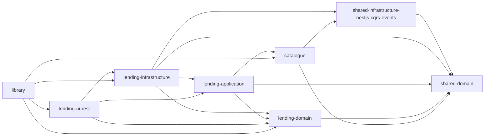
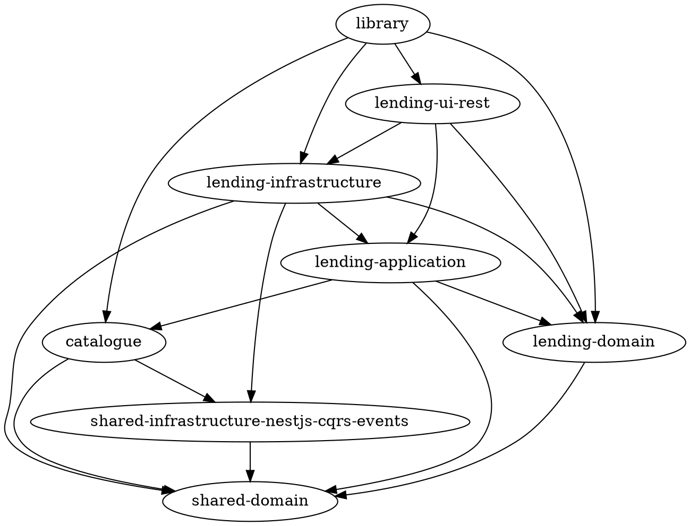

# Usage guide

This guide walks through every output format `nx-mermaid-grapher` can produce,
with real examples generated from the bundled
[`tests/mocks/ddd-example.graph.json`](../tests/mocks/ddd-example.graph.json)
fixture (a small DDD-style Nx workspace with 8 projects and 18 dependencies).

For a one-page overview, the [README](../README.md) is the right place. This
page is for when you want to see exactly what each format looks like before
wiring it into a script, an AI agent prompt, or a CI workflow.

## Table of contents

- [Getting an Nx graph dump](#getting-an-nx-graph-dump)
- [The four output formats](#the-four-output-formats)
  - [`mermaid` (default)](#mermaid-default)
  - [`edges`](#edges)
  - [`json`](#json)
  - [`dot`](#dot)
- [Filtering with `--exclude`](#filtering-with---exclude)
- [Using the library programmatically](#using-the-library-programmatically)
- [Pointers](#pointers)

## Getting an Nx graph dump

Every command in this guide starts with a JSON file produced by Nx:

```bash
# Whole workspace:
npx nx graph --file=graph.json

# Only the projects affected by your branch (against develop):
npx nx graph --affected --file=affected.json --base=origin/develop
```

`nx-mermaid-grapher` then reads that file and emits whichever format you ask
for on stdout.

## The four output formats

Pick one with `-o <format>` (or `--format <format>`). The default is `mermaid`.

### `mermaid` (default)

**When to use it.** When the result is meant to be _seen_ — pasted into a PR
description, a README, a Slack message that supports Mermaid, or shown back to
a user by an AI assistant. Renders natively on GitHub/GitLab and in VS Code-
based editors (Cursor, Windsurf, VSCodium, …) with a Mermaid preview extension.

```bash
npx nx-mermaid-grapher -f tests/mocks/ddd-example.graph.json
```

Output (a fenced ` ```mermaid ` block ready to paste into Markdown):

````

````

Rendered, that looks like:


If you want the body without the ` ```mermaid ` fence (e.g. you are wrapping it
yourself or piping to another tool), add `--raw`:

```bash
npx nx-mermaid-grapher -f graph.json --raw
```

### `edges`

**When to use it.** When you need a no-frills, token-cheap representation of
the topology — for an LLM prompt, a `grep`/`awk` pipeline, or a quick diff.

Each line is `source<space>target`. No header, no quoting, no trailing comma
gymnastics. Isolated nodes (no outgoing edges) are not listed.

```bash
npx nx-mermaid-grapher -f tests/mocks/ddd-example.graph.json -o edges
```

```
shared-infrastructure-nestjs-cqrs-events shared-domain
lending-infrastructure lending-application
lending-infrastructure shared-infrastructure-nestjs-cqrs-events
lending-infrastructure lending-domain
lending-infrastructure shared-domain
lending-application lending-domain
lending-application shared-domain
lending-application catalogue
lending-ui-rest lending-application
lending-ui-rest lending-domain
lending-ui-rest lending-infrastructure
lending-domain shared-domain
catalogue shared-domain
catalogue shared-infrastructure-nestjs-cqrs-events
library catalogue
library lending-ui-rest
library lending-domain
library lending-infrastructure
```

Quick recipes on top of this format:

```bash
# Direct dependents of `shared-domain`:
nx-mermaid-grapher -f graph.json -o edges | awk '$2 == "shared-domain" { print $1 }'

# Pure leaves (projects nothing else depends on):
nx-mermaid-grapher -f graph.json -o edges \
  | awk '{ targets[$2] = 1 } END { for (s in targets) if (!(s in seen)) print s }'
```

### `json`

**When to use it.** When the consumer is code (a script, an AI tool, a custom
visualiser) and you want a stable, structured shape. Single-line, compact JSON
to keep token cost low. **Includes isolated nodes** so the topology can be
reconstructed faithfully.

Shape:

```ts
{
  nodes: string[];          // every project, in declaration order
  edges: [string, string][]; // [source, target] pairs
}
```

Run:

```bash
npx nx-mermaid-grapher -f tests/mocks/ddd-example.graph.json -o json
```

Compact output (one line, abbreviated here for readability):

```json
{"nodes":["shared-infrastructure-nestjs-cqrs-events","lending-infrastructure",
"lending-application","lending-ui-rest","lending-domain","shared-domain",
"catalogue","library"],"edges":[["shared-infrastructure-nestjs-cqrs-events",
"shared-domain"],["lending-infrastructure","lending-application"], …]}
```

Pretty-printed for inspection (`… -o json | python3 -m json.tool` or `| jq`):

```json
{
    "nodes": [
        "shared-infrastructure-nestjs-cqrs-events",
        "lending-infrastructure",
        "lending-application",
        "lending-ui-rest",
        "lending-domain",
        "shared-domain",
        "catalogue",
        "library"
    ],
    "edges": [
        ["shared-infrastructure-nestjs-cqrs-events", "shared-domain"],
        ["lending-infrastructure", "lending-application"],
        ["lending-infrastructure", "shared-infrastructure-nestjs-cqrs-events"],
        ["lending-infrastructure", "lending-domain"],
        ["lending-infrastructure", "shared-domain"],
        ["lending-application", "lending-domain"],
        ["lending-application", "shared-domain"],
        ["lending-application", "catalogue"],
        ["lending-ui-rest", "lending-application"],
        ["lending-ui-rest", "lending-domain"],
        ["lending-ui-rest", "lending-infrastructure"],
        ["lending-domain", "shared-domain"],
        ["catalogue", "shared-domain"],
        ["catalogue", "shared-infrastructure-nestjs-cqrs-events"],
        ["library", "catalogue"],
        ["library", "lending-ui-rest"],
        ["library", "lending-domain"],
        ["library", "lending-infrastructure"]
    ]
}
```

### `dot`

**When to use it.** When you want an actual image (SVG/PNG) and have
[Graphviz](https://graphviz.org/) installed.

```bash
npx nx-mermaid-grapher -f tests/mocks/ddd-example.graph.json -o dot
```

Output:



Render to an image:

```bash
npx nx-mermaid-grapher -f graph.json -o dot | dot -Tsvg > graph.svg
npx nx-mermaid-grapher -f graph.json -o dot | dot -Tpng > graph.png
```

## Filtering with `--exclude`

Any output format can be narrowed by excluding noisy projects. `-e` (or
`--exclude`) is repeatable and removes the named project both as a source and
as a target — so you don't end up with dangling arrows.

```bash
npx nx-mermaid-grapher -f tests/mocks/ddd-example.graph.json \
  -e lending-infrastructure -e lending-ui-rest
```

This is especially useful for AI agent prompts: drop the projects the model
doesn't care about before paying tokens for them.

## Using the library programmatically

Everything the CLI does is also exposed as a TypeScript API:

```ts
import {
  DiGraph,
  NXGraphFileLoader,
  NxMermaidGrapher,
  type OutputFormat,
} from 'nx-mermaid-grapher';

const core = new NxMermaidGrapher(new NXGraphFileLoader(), new DiGraph());
core.init('graph.json');

// Same as `--format mermaid`:
const mermaid = core.getGraphSnippet();

// Same as `--format json -e lending-infrastructure`:
const compactJson = core.getGraphSnippet(['lending-infrastructure'], 'json');

// Or call `formatGraph` directly if you already have a graph object:
import { formatGraph } from 'nx-mermaid-grapher';
const dot = formatGraph({ a: ['b'], b: [] }, 'dot');
```

You can also bring your own graph data structure by implementing `IGraph<T>`
and passing it to `NxMermaidGrapher`. See the
[Code section of the README](../README.md#code) for an example.

## Pointers

- [README](../README.md) — short overview, install, quick examples.
- [Recipes in the README](../README.md#recipes) — affected-only graphs,
  GitHub Actions PR comment workflow.
- [`CHANGELOG.md`](../CHANGELOG.md) — release history.
- [`SECURITY.md`](../SECURITY.md) — how to report vulnerabilities.
